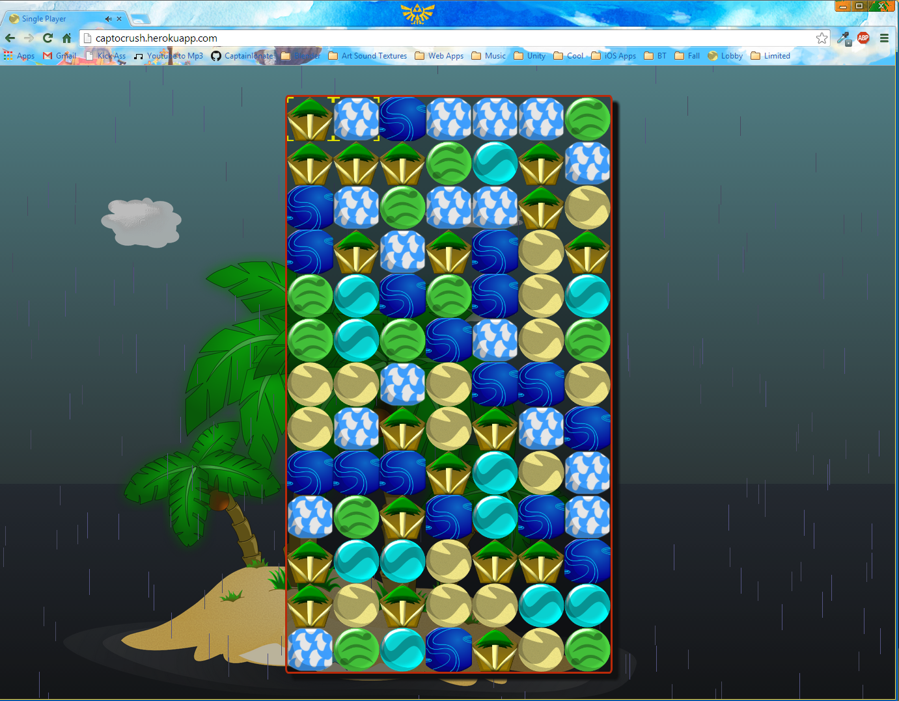
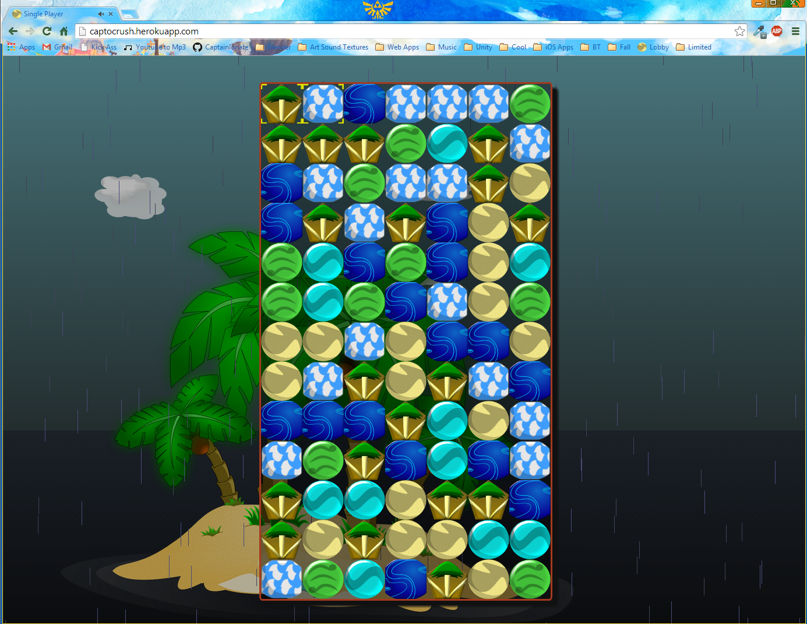
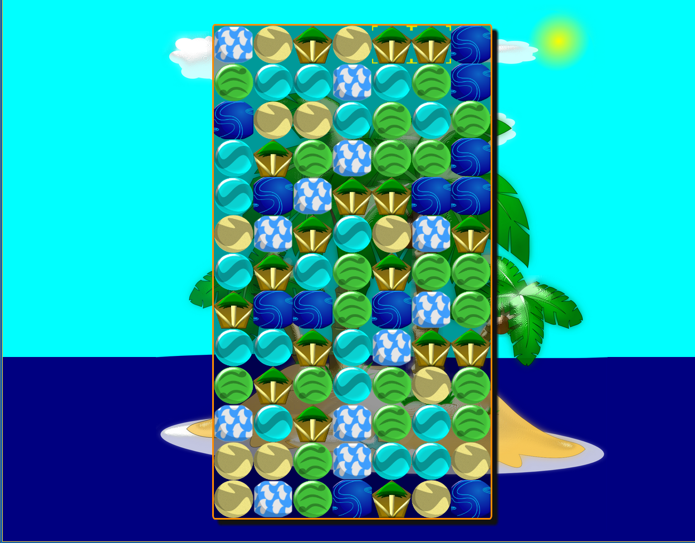

CaptoCrush
==========

# This project & Code is 7 years old. Don't judge the code. I considered marking this as private because I'm ashamed of it.

Match-three tile game like puzzle pirates' Bilging or bejewled

CaptoCrush is basically Bejeweled or Puzzle Pirates' bilging.
You just swap tiles and try to match at least 3 in a row ( or column ).
It took about a day including the artwork which I did in Inkscape.

INTERNET EXPLORER DOES NOT WORK. FOR BEST RESULTS, WINDOWS USERS USE FIREFOX,
MAC USERS USE SAFARI.

You can try it <a href="http://www.sidequestsapps.com/projects/CaptoCrush/Bilge.html">here</a> :)

